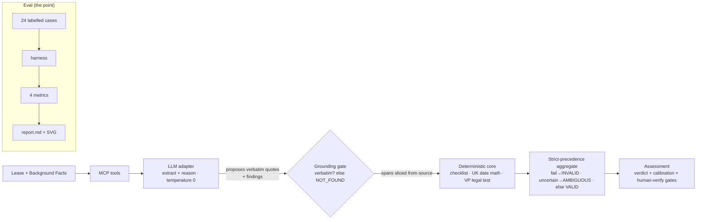

# UK Break Clause Analyzer (MCP)

**A self-evaluating MCP server that assesses whether a UK commercial-lease tenant
break clause can actually be exercised — and publishes its own measured
hallucination rate.**

> ⚖️ **Decision-support only — NOT legal advice.** Built on a deliberately
> simplified, non-proprietary ruleset over synthetic data. A qualified solicitor
> must verify any real decision.

---

## The £2m full stop

In 2012, a tenant served a valid break notice to walk away from a lease — but on
the break date they hadn't paid one quarter's rent that had fallen due a few weeks
earlier. The break failed. They were bound to the lease (and its rent) for years.
No drama, no bad faith — just one unmet condition precedent that everyone missed
until it was too late.

Break clauses are unforgiving like that. Whether a tenant can actually leave turns
on a short checklist — **notice served in time, notice served correctly, no rent
arrears, vacant possession given** — and getting any one wrong is catastrophic. It
is exactly the kind of task you might hand to an LLM... if you could trust it not
to confidently invent the answer.

**This project is about earning that trust, and measuring it.** It is not a clever
parser. It is a reliability harness: every claim is grounded to verbatim source
text or it isn't made, genuinely-ambiguous cases are routed to a human instead of
guessed, and the whole thing ships with an eval that publishes how often it lies.

## The edge

- **Grounded** — every asserted condition is backed by a verbatim source span. If
  the system can't find the text, it returns `NOT_FOUND`; it never invents a quote.
  A deterministic gate slices the span out of the source, so it *can't* echo
  hallucinated text.
- **Calibrated** — when the lease genuinely doesn't settle a point, the answer is
  `AMBIGUOUS — human verify`, not a coin-flip. Abstaining honestly is a feature.
- **Self-evaluating** — a pytest harness scores extraction accuracy, citation
  faithfulness, **hallucination rate**, and calibration against 24 labelled cases.
- **Reasons + verifies** — the LLM only *proposes*; deterministic code *disposes*
  (grounds every quote, does the date arithmetic, applies the vacant-possession
  legal test, aggregates the verdict).

## The headline number

See [`report/report.md`](report/report.md) for the full eval (all four metrics,
per-model comparison, confusion matrix, caught-hallucination examples).

The committed report is the **heuristic baseline** (it runs with no API key) — and
it already tells the core story: the grounding gate drives **ungrounded
(fabricated) hallucinations to zero**, while a non-reasoning baseline still
*misgrounds* and *never abstains* on the genuinely-ambiguous cases. That gap is
exactly what a calibrated LLM is meant to close:

```
uv run python scripts/run_eval.py --record   # measure claude-haiku-4-5 vs claude-sonnet-4-6
```

## How it works



The trust boundary is **structural**: the deterministic `core/` package physically
cannot import the `llm/` package (enforced by a test). "The LLM proposes,
deterministic code disposes" is a property of the codebase, not a discipline.

### The four MCP tools (each does one thing)

| Tool | What it does |
|------|--------------|
| `extract_break_clause` | Returns the break clause + its verbatim source span |
| `check_conditions` | The four-condition checklist: each pass / fail / uncertain, with grounded evidence |
| `find_citation` | Exact verbatim supporting text for a claim, or `NOT_FOUND` |
| `assess_validity` | Orchestrated verdict + calibration note + mandatory human-verify gates |

## Quickstart (clone to running in under 2 minutes)

```bash
# 1. Install uv (skip if you have it)
curl -LsSf https://astral.sh/uv/install.sh | sh

# 2. Install deps (uv fetches its own Python 3.12)
uv sync

# 3. Run the test suite — proves the eval apparatus is correct
uv run pytest -q

# 4. Check the dataset (every gold span verbatim, every label coherent)
uv run python scripts/validate_dataset.py

# 5. Regenerate the eval report
uv run python scripts/run_eval.py        # heuristic baseline, no key needed
```

No `ANTHROPIC_API_KEY` is required for any of the above — the eval falls back to the
heuristic baseline and is fully reproducible. Set the key (and `--record`) to
measure the real Claude models.

## Run the MCP server

```bash
# Inspect it interactively (the official MCP Inspector)
npx @modelcontextprotocol/inspector uv run break-clause-analyzer
```

Or wire it into an MCP client (e.g. Claude Desktop) — `claude_desktop_config.json`:

```json
{
  "mcpServers": {
    "break-clause-analyzer": {
      "command": "uv",
      "args": ["run", "break-clause-analyzer"],
      "env": { "ANTHROPIC_API_KEY": "sk-ant-…" }
    }
  }
}
```

Without a key the server still runs and responds — it uses the heuristic baseline
and says so. Every tool response carries the decision-support disclaimer.

## Reproducible evals (cassettes)

`temperature=0` is *not* a determinism guarantee from the API, so reproducibility
comes from recorded cassettes (VCR.py). `scripts/run_eval.py --record` records one
cassette set per model with the `x-api-key` header redacted; re-running without
`--record` replays them with no key in seconds. See
[`eval/cassettes/README.md`](eval/cassettes/README.md).

## Layout

```
src/break_clause_analyzer/
  core/       # deterministic trust boundary (no network; cannot import llm/)
    grounding.py  dates.py  checklist.py  aggregate.py
  llm/        # the only network egress (Anthropic + heuristic fallback)
  pipeline.py # propose → gate → dispose orchestration
  server.py   # FastMCP server: the four tools
data/cases/   # 24 labelled synthetic case files (+ dataset README)
eval/         # harness, metrics, report generator, cassettes
docs/METHODOLOGY.md  # pre-registered metric definitions
report/       # generated eval report + SVG
.planning/    # the eval-first roadmap, requirements, and decision log
```

## Methodology & honesty

The metric definitions are **pre-registered** in
[`docs/METHODOLOGY.md`](docs/METHODOLOGY.md) before any model is run, so the
headline number can't be defined after the fact to look good. The hallucination
rate counts misgrounding and overconfidence — not just fabrication — precisely
because a grounding gate makes fabrication trivially zero. The scorer uses no LLM
judge; it is validated against a gold oracle and deliberately-broken systems in
[`tests/test_harness.py`](tests/test_harness.py).

## Scope (deliberately narrow)

Tenant break clauses only · four conditions precedent · synthetic/public data only
· decision-support, not legal advice. Other lease provisions, landlord breaks, real
client data, and a production engine are explicitly out of scope.

---
*Built as a reliability-engineering artifact. The eval is the point.*
