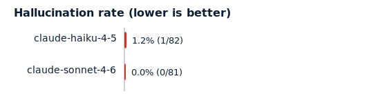

# Evaluation Report — UK Break Clause Analyzer

> DECISION-SUPPORT ONLY — NOT LEGAL ADVICE. This tool applies a deliberately simplified, non-proprietary ruleset to synthetic data and can be wrong. A qualified solicitor must independently verify any real break-clause decision.

**Run mode:** recorded cassettes (replay, no key)  
**Cases (eval split):** 17  
**Provenance:** replayed from committed cassettes

## Headline — measured hallucination rate

**claude-haiku-4-5: 1.2%**, **claude-sonnet-4-6: 0.0%**.

A hallucination is any *asserted* condition or clause that is **ungrounded** (no verbatim support), **misgrounded** (real citation, wrong conclusion), or **overconfident** (a definite answer on a genuinely-ambiguous condition). Honest abstentions (`uncertain` / NOT_FOUND) are never counted. Denominator = total assertions made. See [`docs/METHODOLOGY.md`](../docs/METHODOLOGY.md) for the pre-registered definitions.

## All four metrics

| Metric | claude-haiku-4-5 | claude-sonnet-4-6 |
|---|---|---|
| Hallucination rate ⬇ | **1.2%** | **0.0%** |
|   — ungrounded / misgrounded / overconfident | 0 / 0 / 1 | 0 / 0 / 0 |
|   — case-level | 5.9% | 0.0% |
| Extraction accuracy ⬆ | 52.9% | 52.9% |
| Citation verbatim-rate ⬆ | 100.0% | 100.0% |
| Citation support F1 ⬆ | 82.4% | 84.2% |
| Overall verdict accuracy ⬆ | 94.1% | 100.0% |
| Coverage (answered) ⬆ | 88.2% | 82.4% |
| Accuracy on answered ⬆ | 93.3% | 100.0% |
| Abstention precision ⬆ | 100.0% | 100.0% |
| Abstention recall ⬆ | 66.7% | 100.0% |

## Verdict confusion matrix

**claude-haiku-4-5**

| gold ↓ \ system → | VALID | INVALID | AMBIGUOUS |
|---|---|---|---|
| VALID | 5 | 0 | 0 |
| INVALID | 0 | 9 | 0 |
| AMBIGUOUS | 1 | 0 | 2 |

**claude-sonnet-4-6**

| gold ↓ \ system → | VALID | INVALID | AMBIGUOUS |
|---|---|---|---|
| VALID | 5 | 0 | 0 |
| INVALID | 0 | 9 | 0 |
| AMBIGUOUS | 0 | 0 | 3 |

## Where errors concentrate

**claude-haiku-4-5** — hallucinations by condition:
- Vacant possession: 1

_claude-sonnet-4-6: no condition-level hallucinations._

## Caught-hallucination examples

**claude-haiku-4-5**

- **case-004 · Vacant possession** — system asserted `pass`, gold is `uncertain` → caught as **overconfident**.

**claude-sonnet-4-6**

_None — the system made no condition-level hallucinations._

## Limitations & reproducibility

- Synthetic, non-proprietary dataset on a deliberately simplified four-condition ruleset — not a measure of real-world legal accuracy.
- Metrics are computed against gold labels (no LLM judge), so the scorer is deterministic and auditable; it was validated against a gold oracle and deliberately-broken systems (`tests/test_harness.py`).
- Reproducibility comes from recorded cassettes, not from `temperature=0` (which the API does not guarantee). Re-run `scripts/run_eval.py` to regenerate.
